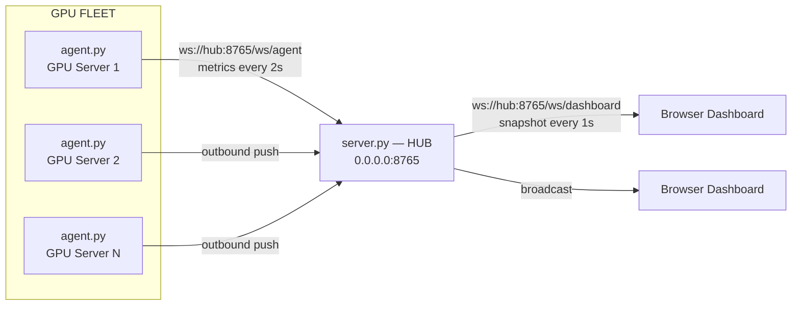

# GPU//TACTICAL

**Real-time GPU & RAM monitoring over pure WebSocket — no SSH, no polling, no manually-added remotes.**

A lightweight, self-hosted monitoring system for NVIDIA GPU fleets. Every GPU machine runs a tiny *agent* that pushes `nvidia-smi` telemetry outward to a central *hub*; the hub broadcasts everything to a dark, Call-of-Duty-inspired tactical HUD dashboard in the browser. Machines auto-register the moment their agent starts and are flagged the moment they go silent.

---

## Table of Contents

1. [How It Works](#how-it-works)
2. [Why WebSocket-Only](#why-websocket-only)
3. [Repository Layout](#repository-layout)
4. [Quick Start](#quick-start)
5. [Configuration Reference](#configuration-reference)
6. [The Wire Protocol](#the-wire-protocol)
7. [Dashboard Guide](#dashboard-guide)
8. [Operator Profiles](#operator-profiles)
9. [Changing the Main Server (Migration Playbook)](#changing-the-main-server-migration-playbook)
10. [Running as a Service](#running-as-a-service)
11. [Security](#security)
12. [Troubleshooting](#troubleshooting)
13. [FAQ](#faq)

---

## How It Works



The system has exactly **three moving parts**:

| Part | Where it runs | What it does |
|---|---|---|
| **Agent** (`agent/agent.py`) | Every GPU machine | Reads `nvidia-smi` (utilization, VRAM, temperature, power, fan, clock) plus system RAM every 2 seconds, and pushes it to the hub over a single outbound WebSocket. Pure Python stdlib + `aiohttp` — no drivers, no root, no extra daemons. |
| **Hub** (`server/server.py`) | The main server | Accepts agent connections on `/ws/agent`, keeps the latest reading per host in memory, and broadcasts a full snapshot to every dashboard on `/ws/dashboard` once per second. Also serves the dashboard UI over plain HTTP. Completely **stateless** — no database, nothing to migrate. |
| **Dashboard** (`server/static/index.html`) | Any browser | Single self-contained HTML file. Connects back to whatever host served it (`location.host`) — nothing is hardcoded. Renders live cards per machine with animated load bars, sparklines, and status. |

### The lifecycle of a machine

1. You run `python agent.py` on a GPU server. That's the entire onboarding.
2. The agent opens an **outbound** WebSocket to the hub and starts pushing metrics. The hub registers the host by its hostname — **no remote is ever added manually** on the hub.
3. The dashboard card for that machine appears within one broadcast tick (≤ 1 s).
4. If the hub receives nothing from a host for **8 s** (configurable), the card flips to a blinking red **SIGNAL LOST**.
5. If the host stays silent for **10 min** (configurable), the hub forgets it entirely and the card disappears — so renamed or decommissioned machines don't haunt the board.
6. Agents that lose the connection reconnect automatically with exponential backoff (1 s → 30 s max), cycling through every URL in their failover list. Dashboards auto-reconnect the same way.

---

## Why WebSocket-Only

Traditional GPU monitoring either **polls** (the server SSHes into or HTTP-scrapes every machine on a timer) or requires a heavyweight metrics stack (Prometheus + exporters + Grafana). This project deliberately does neither:

- **Outbound-only agents.** Agents dial out; the hub never dials in. GPU machines need zero open inbound ports, zero SSH keys handed to the hub, and they can live behind NAT.
- **No registration step.** The hub discovers machines from the connections themselves. Fleet grows by running one command on the new machine.
- **One persistent socket instead of N requests.** A 2-second telemetry cadence over an already-open TCP connection costs almost nothing; there is no per-poll SSH/TLS handshake overhead.
- **Push latency.** The dashboard shows changes within ~1–3 seconds of them happening on the metal.

---

## Repository Layout

```
GPU-DashBoard/
├── agent/
│   ├── agent.py          # telemetry agent — run this on every GPU machine
│   └── config.json       # hub address(es), auth token, push interval
├── server/
│   ├── server.py         # the hub — run this on the main server
│   └── static/
│       └── index.html    # tactical HUD dashboard (fully self-contained)
├── requirements.txt      # aiohttp — the only dependency, for both sides
└── README.md
```

---

## Quick Start

### 1 — Hub (the main server)

```bash
git clone https://github.com/AnshPatwa/GPU-DashBoard.git
cd GPU-DashBoard
pip install -r requirements.txt
python server/server.py
```

The hub listens on `0.0.0.0:8765`. Open the dashboard at:

```
http://<hub-ip>:8765
```

> **Windows hub:** allow inbound connections once (admin PowerShell):
> ```powershell
> New-NetFirewallRule -DisplayName "GPU Tactical Hub" -Direction Inbound -Protocol TCP -LocalPort 8765 -Action Allow
> ```
> **Linux hub with ufw:** `sudo ufw allow 8765/tcp`

### 2 — Agent (every GPU machine)

```bash
git clone https://github.com/AnshPatwa/GPU-DashBoard.git && cd GPU-DashBoard \
  && pip install -r requirements.txt && python3 agent/agent.py
```

Before the first run, point `agent/config.json` at your hub:

```json
{
  "server_urls": ["ws://<hub-ip>:8765/ws/agent"],
  "token": "",
  "interval": 2.0,
  "hostname": null
}
```

Or skip editing entirely with an environment variable:

```bash
GPU_AGENT_SERVER=ws://<hub-ip>:8765/ws/agent python3 agent/agent.py
```

To keep it running after you close the terminal:

```bash
nohup python3 agent/agent.py > agent.log 2>&1 &
```

### 3 — No GPU handy? Demo mode

```bash
python agent/agent.py --demo
```

Simulates a machine with two GPUs (sine-wave load curves) — useful for testing the hub and dashboard without hardware.

---

## Configuration Reference

### Agent — `agent/config.json` + environment overrides

| Config key | Env override | Default | Meaning |
|---|---|---|---|
| `server_urls` | `GPU_AGENT_SERVER` | — (required) | **Ordered failover list** of hub URLs. The agent tries them in order and rotates to the next on any failure. |
| `token` | `GPU_AGENT_TOKEN` | `""` | Auth token, must match the hub's token if the hub sets one. |
| `interval` | `GPU_AGENT_INTERVAL` | `2.0` | Seconds between telemetry pushes. |
| `hostname` | `GPU_AGENT_HOSTNAME` | `null` → machine hostname | Display name on the dashboard. Set it to give a machine a friendly name. |

Environment variables always win over `config.json`, so a cloned repo never needs local edits just to point somewhere else.

### Hub — environment variables

| Variable | Default | Meaning |
|---|---|---|
| `GPU_MONITOR_HOST` | `0.0.0.0` | Bind address. |
| `GPU_MONITOR_PORT` | `8765` | HTTP + WebSocket port (single port for everything). |
| `GPU_MONITOR_TOKEN` | `""` (off) | If set, agents **and** dashboards must present it (`?token=...`). |
| `GPU_MONITOR_OFFLINE_AFTER` | `8` | Seconds of silence before a host is marked **SIGNAL LOST**. |
| `GPU_MONITOR_FORGET_AFTER` | `600` | Seconds of silence before a dead host is removed from the board entirely. |

---

## The Wire Protocol

Everything on the wire is JSON over WebSocket. There are two message types.

### Agent → Hub (`/ws/agent`) — every `interval` seconds

```json
{
  "type": "metrics",
  "host": "gpu-node-01",
  "ts": 1789000000.0,
  "gpus": [
    {
      "index": 0,
      "name": "NVIDIA GeForce RTX 3050 Laptop GPU",
      "util": 33.0,
      "mem_used": 742.0,
      "mem_total": 4096.0,
      "temp": 58.0,
      "power": 12.1,
      "power_limit": 0.0,
      "fan": 0.0,
      "clock": 502.0
    }
  ],
  "gpu_error": null,
  "ram": { "total_gb": 15.4, "used_gb": 10.9, "percent": 70.5 }
}
```

Notes:
- `mem_used` / `mem_total` are in **MiB** (as reported by nvidia-smi); the dashboard converts to GB.
- Fields nvidia-smi reports as `[N/A]` (common for `fan`/`power_limit` on laptops) arrive as `0.0`; the dashboard hides those chips instead of showing junk.
- If `nvidia-smi` itself fails (driver hiccup, missing binary), the agent still sends RAM plus a `gpu_error` string, which the dashboard shows as an `NVIDIA-SMI FAULT` line — you keep visibility into the machine either way.

### Hub → Dashboard (`/ws/dashboard`) — every second

```json
{
  "type": "snapshot",
  "ts": 1789000001.0,
  "servers": [
    {
      "host": "gpu-node-01",
      "online": true,
      "last_seen": 1789000000.9,
      "connected_at": 1788999900.0,
      "metrics": { "...": "the full latest agent payload, verbatim" }
    }
  ]
}
```

A full snapshot every tick (rather than deltas) keeps the dashboard logic trivial and makes reconnects self-healing — the first message after any reconnect fully rebuilds the view.

---

## Dashboard Guide

The UI is a single dark **tactical HUD** — no build step, no CDN, no external fonts; it works fully offline once served.

- **Header** — live clock, hub uplink LED (`UPLINK ACTIVE` / `UPLINK LOST — RETRYING` with auto-reconnect), and the current operator chip.
- **Sector Overview** — fleet-wide tiles: units online, GPUs deployed, average GPU load, total VRAM in use.
- **Deployed Units** — one card per machine:
  - Per GPU: big stencil **load percentage**, segmented ammo-style load bar (turns **red at ≥ 90%**), VRAM bar with exact GB, live **sparkline** of the last ~3 minutes of load, and telemetry chips — **CLK** (core MHz), **FAN** (hidden when the sensor reports N/A), **TEMP** (amber ≥ 65 °C, red ≥ 80 °C), **PWR** (draw / limit).
  - Per machine: **SYSTEM RAM** bar with used/total and percentage.
  - Status pill: green `◉ OPERATIONAL` or blinking red `◌ SIGNAL LOST`.
- **Atmosphere** — physics-simulated smoke (buoyancy, drag, turbulent eddies, wind drift, expansion/dissipation, occasional ember-lit puffs), falling ash, and rising embers on a canvas layer *behind* the translucent panels. The simulation pauses automatically when the tab is hidden, and all sprites are pre-rendered — it stays cheap.
- **Empty state** — a radar sweep with instructions, shown until the first agent connects.

If the hub restarts, dashboards and agents both reconnect on their own; the board repopulates within seconds.

---

## Operator Profiles

Opening the dashboard presents a **SELECT OPERATOR** screen (Netflix-profile style) so multiple people can use the same board under their own identity:

- Three built-in operators: **GHOST**, **VIPER**, **REAPER** — each with a color-coded hex avatar.
- **NEW OPERATOR** lets anyone register a custom callsign (stored in that browser's `localStorage`, so each person's browser remembers their own identity).
- The chosen operator shows in the header; **SWITCH OPERATOR** returns to the select screen.

Profiles are a client-side identity layer — they don't gate data access. For actual access control, set `GPU_MONITOR_TOKEN` (see [Security](#security)).

---

## Changing the Main Server (Migration Playbook)

The hub is **stateless**, so "migrating the main server" is nothing more than running `server.py` somewhere else and telling agents where to look. Three strategies, best first:

### Strategy 1 — DNS name (zero-touch, recommended)

Point agents at a name instead of an IP:

```json
{ "server_urls": ["ws://gpu-hub.internal.company:8765/ws/agent"] }
```

To migrate: start the hub on the new machine, flip the DNS record. Agents notice the dead connection, reconnect, and land on the new hub — **no agent is ever touched**.

### Strategy 2 — Failover list (built into the agent)

```json
{
  "server_urls": [
    "ws://old-hub:8765/ws/agent",
    "ws://new-hub:8765/ws/agent"
  ]
}
```

Agents walk the list on every failure. Shut the old hub down and the whole fleet drains to the new one automatically. Ship this list *before* the migration and the cutover is a single `Ctrl-C` on the old hub.

### Strategy 3 — One-line edit

Change the URL in `config.json` (or export `GPU_AGENT_SERVER`) and restart the agent. Crude but honest.

**On the new hub machine, the entire setup is:**

```bash
git clone https://github.com/AnshPatwa/GPU-DashBoard.git && cd GPU-DashBoard
pip install -r requirements.txt
python server/server.py
```

No state, no database, no export/import. Sparkline history lives in each browser tab and simply rebuilds.

---

## Running as a Service

### Linux — systemd (agents and hub alike)

`/etc/systemd/system/gpu-agent.service`:

```ini
[Unit]
Description=GPU Tactical Agent
After=network-online.target
Wants=network-online.target

[Service]
WorkingDirectory=/opt/GPU-DashBoard
ExecStart=/usr/bin/python3 /opt/GPU-DashBoard/agent/agent.py
Restart=always
RestartSec=5

[Install]
WantedBy=multi-user.target
```

```bash
sudo systemctl daemon-reload
sudo systemctl enable --now gpu-agent
journalctl -u gpu-agent -f        # tail logs
```

For the hub, duplicate the unit with `ExecStart=... server/server.py` (name it `gpu-hub.service`).

### Windows — Task Scheduler

Task Scheduler → *Create Task* → Trigger: **At startup** → Action:

```
Program:   python
Arguments: C:\GPU-DashBoard\server\server.py
```

Tick *"Run whether user is logged on or not"*. Same pattern for an agent.

---

## Security

- **Shared token.** Start the hub with `GPU_MONITOR_TOKEN=<secret>`; give agents the same value (`token` in config or `GPU_AGENT_TOKEN`). Dashboards then need `http://hub:8765/?token=<secret>`. Connections with a bad token are rejected with `401`.
- **Network posture.** Agents are outbound-only — GPU machines expose nothing. The hub exposes exactly one TCP port. Keep it on a LAN/VPN; if it must cross the internet, front it with a reverse proxy (nginx/caddy) doing TLS, and the dashboard will automatically use `wss://`.
- **Read-only by design.** The protocol carries telemetry out; there is no command channel back into agents. A compromised dashboard session can *watch* your GPUs, not touch them.

---

## Troubleshooting

| Symptom | Likely cause → fix |
|---|---|
| Dashboard loads but shows *SCANNING FOR UNITS* | No agent has ever connected. Check the agent terminal — it prints `connected -> ws://...` on success. |
| Agent prints `connection lost/failed ... retry in Ns` | Hub unreachable: wrong IP/port in `server_urls`, hub not running, or a firewall. From the agent machine: `curl http://<hub-ip>:8765` should return HTML. On a Windows hub, open port 8765 (see Quick Start). |
| Machine shows **SIGNAL LOST** but the agent is running | Agent lost its socket and is reconnecting (watch its log), or the machine's clock jumped. It re-flips to OPERATIONAL on the next successful push. |
| Card shows `NVIDIA-SMI FAULT: ...` | The agent is healthy but `nvidia-smi` failed — driver problem or binary not on `PATH`. RAM keeps reporting meanwhile. |
| `401` / instant disconnects | Token mismatch between hub and agent/dashboard. |
| Two machines merge into one card | Both report the same hostname. Set a unique `hostname` in each agent's config (or `GPU_AGENT_HOSTNAME`). |
| Stale machine won't leave the board | It lingers as SIGNAL LOST for `GPU_MONITOR_FORGET_AFTER` (default 10 min), then auto-removes. Restart the hub to clear instantly. |
| FAN / power-limit chip missing | nvidia-smi reports `[N/A]` for that sensor on this hardware (typical on laptops). Hidden by design. |

---

## FAQ

**How many machines can one hub handle?**
The hub does trivial work — JSON in, JSON out, no disk. Hundreds of agents at a 2 s cadence is well within a single asyncio process on modest hardware.

**Does it store history?**
No. The hub keeps only the latest reading per host; sparklines are built client-side from the live stream (~3 minutes of context). That's what keeps the hub stateless and migration free. If you need long-term history, tee the agent payloads into a time-series DB — the protocol above is all you need.

**Can I monitor AMD / Apple GPUs?**
Out of the box, no — the agent shells out to `nvidia-smi`. But only `read_gpus()` in `agent/agent.py` knows about NVIDIA; swap in `rocm-smi` parsing there and everything else works unchanged.

**Why does each browser get its own operator list?**
Custom callsigns live in `localStorage` — deliberately serverless, so profiles can't break monitoring. Built-in operators are shared by everyone.

**What Python version do I need?**
3.10+ on both sides. The only dependency is `aiohttp`.

---

*Built for operators who want to see their fleet breathe — one socket per machine, one glance for everything.*
